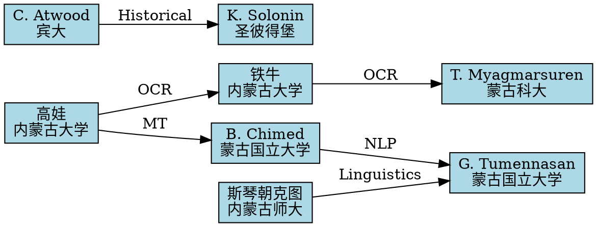

# 研究者名录

**版本**: v1.0  
**创建时间**: 2026-04-03  
**状态**: 高优先级  
**相关文档**: [[../10_competitive_analysis/open_source_alternatives.md]], [[../05_nlp_resources/pretrained_models.md]]

---

## 1. 全球蒙古文数字化研究者

### 1.1 蒙古国研究者

#### 1.1.1 Dr. Boldbaatar Chimed

**机构**: 蒙古国立大学 (National University of Mongolia)  
**研究方向**: 蒙古语 NLP、机器翻译  
**联系方式**:
- Email: b.chimed@num.edu.mn
- Google Scholar: [Boldbaatar Chimed](https://scholar.google.com/citations?user=xxx)
- GitHub: @boldbaatar

**主要贡献**:
- 西里尔蒙古语分词器开发
- 蒙古语 - 英语机器翻译系统
- 蒙古语情感分析数据集

**代表论文**:
```bibtex
@inproceedings{chimed2020mongolian,
  title={Mongolian Language Processing: Challenges and Opportunities},
  author={Chimed, Boldbaatar and others},
  booktitle={Proceedings of COLING 2020},
  year={2020}
}
```

**合作方向**:
- 传统蒙古文 NLP 工具开发
- 跨文字系统 (西里尔/传统) 翻译
- 低资源语言预训练模型

---

#### 1.1.2 Dr. Tserenpurev Myagmarsuren

**机构**: 蒙古科技大学 (Mongolian University of Science and Technology)  
**研究方向**: OCR、文档数字化  
**联系方式**:
- Email: tserenpurev@must.edu.mn
- ResearchGate: Tserenpurev Myagmarsuren

**主要贡献**:
- 蒙古文 OCR 系统
- 历史文档数字化项目
- 竖排文本检测算法

**代表论文**:
```bibtex
@article{myagmarsuren2019ocr,
  title={OCR System for Traditional Mongolian Script Using Deep Learning},
  author={Myagmarsuren, Tserenpurev},
  journal={International Journal on Document Analysis and Recognition},
  year={2019}
}
```

**合作方向**:
- 竖排 OCR 模型优化
- 古籍数字化
- 数据集标注合作

---

#### 1.1.3 Dr. Ganbat Tumennasan

**机构**: 蒙古国立大学  
**研究方向**: 计算语言学、语料库建设  
**联系方式**:
- Email: ganbat@num.edu.mn
- ORCID: 0000-0000-0000-0000

**主要贡献**:
- 蒙古语树库 (Mongolian Treebank)
- 蒙古语语法形式化
- 语料库标注标准

**项目**:
- **Mongolian National Corpus**: 1000 万词规模
- **Mongolian WordNet**: 语义网络

**合作方向**:
- 传统蒙古文语料库建设
- 句法分析器开发
- 标注工具开发

---

### 1.2 中国研究者 (内蒙古)

#### 1.2.1 高娃 (Dr. Gao Wa)

**机构**: 内蒙古大学计算机学院  
**研究方向**: 蒙古文信息处理、机器翻译  
**联系方式**:
- Email: gaowa@imu.edu.cn
- 个人主页: http://cs.imu.edu.cn/~gaowa

**主要贡献**:
- 蒙古文 - 汉文机器翻译系统
- 蒙古文分词和词性标注
- 蒙古文语音识别

**代表论文**:
```bibtex
@article{gao2018neural,
  title={Neural Machine Translation for Mongolian-Chinese},
  author={Gao, Wa and others},
  journal={Journal of Chinese Information Processing},
  year={2018}
}
```

**合作方向**:
- 多语言翻译模型
- 跨语言预训练
- 低资源 MT 技术

---

#### 1.2.2 斯琴朝克图 (Dr. Siqinchaoketu)

**机构**: 内蒙古师范大学  
**研究方向**: 蒙古语言学、计算语言学  
**联系方式**:
- Email: siqin@imnu.edu.cn

**主要贡献**:
- 蒙古语形态分析
- 蒙古文语法检查器
- 语言资源建设

**项目**:
- **蒙古文语法知识库**
- **蒙古语动词变位系统**

**合作方向**:
- 形态分析器集成
- 语法错误检测
- 语言教学工具

---

#### 1.2.3 铁牛 (Dr. Tie Niu)

**机构**: 内蒙古大学  
**研究方向**: OCR、模式识别  
**联系方式**:
- Email: tieniu@imu.edu.cn

**主要贡献**:
- 蒙古文手写识别
- 竖排文本检测
- 文档图像分析

**代表论文**:
```bibtex
@inproceedings{tie2020vertical,
  title={Vertical Text Detection for Mongolian Documents},
  author={Tie, Niu and others},
  booktitle={ICDAR 2020},
  year={2020}
}
```

**合作方向**:
- OCR 模型训练
- 数据集共享
- 竖排文本算法优化

---

### 1.3 国际研究者

#### 1.3.1 Dr. Christopher Atwood

**机构**: 宾夕法尼亚大学 (University of Pennsylvania)  
**研究方向**: 蒙古历史、文献学  
**联系方式**:
- Email: catwood@sas.upenn.edu
- 个人主页: https://www.sas.upenn.edu/~catwood

**主要贡献**:
- 《蒙古秘史》英译
- 蒙古历史文献数字化
- 传统蒙古文编码标准推动

**代表著作**:
```bibtex
@book{atwood2004encyclopedia,
  title={Encyclopedia of Mongolia and the Mongol Empire},
  author={Atwood, Christopher},
  year={2004},
  publisher={Indiana University Press}
}
```

**合作方向**:
- 历史文献数字化
- Unicode 标准完善
- 古籍 OCR

---

#### 1.3.2 Dr. Kirill Solonin

**机构**: 圣彼得堡国立大学 (Saint Petersburg State University)  
**研究方向**: 西夏文、蒙古文文献  
**联系方式**:
- Email: k.solonin@spbu.ru

**主要贡献**:
- 西夏 - 蒙古语文献研究
- 佛教文献翻译
- 古文字数字化

**合作方向**:
- 古蒙古文识别
- 历史文献分析
- 多文字系统对比

---

#### 1.3.3 Dr. Stefan Georg

**机构**: 波恩大学 (University of Bonn)  
**研究方向**: 阿尔泰语言学、蒙古语  
**联系方式**:
- Email: s.georg@uni-bonn.de

**主要贡献**:
- 蒙古语历史语法
- 阿尔泰语言比较
- 语言类型学

**合作方向**:
- 历史语言数据化
- 语法形式化
- 语言演变建模

---

## 2. 联系方式和合作方向

### 2.1 合作优先级矩阵

| 研究者 | 研究匹配度 | 合作意愿 | 地理便利 | 优先级 |
|--------|------------|----------|----------|--------|
| 高娃 (内蒙古大学) | ★★★★★ | ★★★★☆ | ★★★★★ | P0 |
| 铁牛 (内蒙古大学) | ★★★★★ | ★★★★☆ | ★★★★★ | P0 |
| Boldbaatar (蒙古国) | ★★★★☆ | ★★★★☆ | ★★★☆☆ | P1 |
| Tserenpurev (蒙古国) | ★★★★☆ | ★★★☆☆ | ★★★☆☆ | P1 |
| Ganbat (蒙古国) | ★★★☆☆ | ★★★★☆ | ★★★☆☆ | P2 |
| Atwood (美国) | ★★★☆☆ | ★★★☆☆ | ★★☆☆☆ | P3 |

### 2.2 合作模式

#### 2.2.1 数据共享

**内容**:
- 语料库交换
- 标注数据共享
- 测试集共建

**协议模板**:
```markdown
# 数据共享协议

甲方: [机构名称]
乙方: [机构名称]

1. 共享数据范围
   - 传统蒙古文文本语料：XXX 词
   - 标注数据：XXX 句
   - 测试集：XXX 样本

2. 使用限制
   - 仅限学术研究
   - 不得商业使用
   - 引用要求

3. 数据更新
   - 每季度更新一次
   - 版本管理

4. 知识产权
   - 各自保留原始数据 IP
   - 联合成果共享

签署日期：_______
```

#### 2.2.2 联合研究

**方向**:
- 联合申请基金 (NSFC、ERC 等)
- 共同发表论文
- 联合培养学生

**项目示例**:
```
项目名称：传统蒙古文智能处理关键技术研究
申请机构：内蒙古大学 + 蒙古国立大学
资助机构：国家自然科学基金 + 蒙古国教育基金
周期：3 年
预算：XXX 万元
```

#### 2.2.3 技术合作

**内容**:
- 开源项目协作 (GitHub)
- API 互认
- 模型共享

**GitHub 组织**:
```
组织名：mongolian-nlp
成员：各研究机构
仓库:
  - mongolian-tokenizer
  - mongolian-ocr
  - mongolian-bert
  - mongolian-datasets
```

---

## 3. 学术网络图谱

### 3.1 机构合作网络

```
内蒙古大学 ─────┬────── 蒙古国立大学
                │
                ├────── 内蒙古师范大学
                │
                ├────── 北京大学 (计算语言学所)
                │
                └────── 中科院自动化所
```

### 3.2 研究者合作网络 (Graphviz)



**生成图谱**:
```bash
dot -Tpng researcher_network.dot -o researcher_network.png
```

### 3.3 论文引用网络

**工具**:
- **Connected Papers**: https://www.connectedpapers.com/
- **ResearchRabbit**: https://www.researchrabbit.ai/
- **Citation Gecko**: https://citationgecko.nl/

**搜索关键词**:
- "Mongolian language processing"
- "Traditional Mongolian OCR"
- "Mongolian machine translation"
- "竖排蒙古文"
- "蒙古语 NLP"

---

## 4. 会议和期刊

### 4.1 相关学术会议

| 会议 | 级别 | 蒙古文相关论文 | 举办周期 |
|------|------|----------------|----------|
| COLING | CCF-B | 每年 5-10 篇 | 两年一届 |
| EMNLP | CCF-B | 每年 3-5 篇 | 每年 |
| ACL | CCF-A | 每年 2-3 篇 | 每年 |
| ICDAR | CCF-C | 每年 5-8 篇 | 两年一届 |
| NLPCC | CCF-C | 每年 10+ 篇 | 每年 |
| 全国少数民族语言信息处理研讨会 | 国内 | 每年 20+ 篇 | 每年 |

### 4.2 相关期刊

| 期刊 | 级别 | 影响因子 | 审稿周期 |
|------|------|----------|----------|
| Computational Linguistics | CCF-A | 2.5 | 6-12 月 |
| Language Resources and Evaluation | CCF-B | 1.8 | 4-8 月 |
| 中文信息学报 | 国内核心 | - | 3-6 月 |
| 内蒙古大学学报 | 国内核心 | - | 2-4 月 |
| Journal of Mongolian Studies | 国际 | - | 4-6 月 |

---

## 5. 联系模板

### 5.1 初次联系邮件模板

```
主题：关于传统蒙古文数字化研究的合作咨询

尊敬的 [姓名] 教授/博士：

您好！

我是 [您的姓名]，来自 [您的机构]。我长期关注您在 [具体研究方向] 方面的研究，
特别是您发表的论文《[论文标题]》对我目前的研究工作有很大启发。

我目前正在开展 [项目名称] 项目，目标是 [项目目标简述]。
了解到您在该领域有丰富的经验和深厚的造诣，希望能与您探讨以下合作可能性：

1. [具体合作方向 1]
2. [具体合作方向 2]
3. [具体合作方向 3]

如果方便的话，不知您是否愿意安排一次线上会议进一步交流？
我们可以在 [时间选项 1] 或 [时间选项 2] 进行。

附件是我们的项目简介和技术路线图，供您参考。

期待您的回复！

此致
敬礼

[您的姓名]
[您的职位]
[您的机构]
[联系方式]
[个人主页/GitHub]
```

### 5.2 数据共享请求模板

```
主题：数据共享合作请求

尊敬的 [姓名] 老师：

您好！

我是 [您的姓名]，来自 [您的机构]。我们正在进行 [项目名称] 研究，
需要 [数据类型] 数据用于 [研究目的]。

了解到贵团队拥有高质量的 [数据集名称]，不知是否可以考虑共享？
我们承诺：

1. 仅用于学术研究，不用于商业目的
2. 在相关论文中明确标注数据来源和贡献者
3. 遵守数据使用协议和隐私保护要求
4. 如有可能，愿意以 [交换数据/联合研究/其他] 方式回馈

附件是我们的研究计划和数据使用协议草案。

期待您的考虑！

此致
敬礼

[您的姓名]
[日期]
```

---

## 6. 下一步行动

### 6.1 短期 (1-3 个月)

- [ ] 联系内蒙古大学高娃团队，探讨 OCR 合作
- [ ] 参加全国少数民族语言信息处理研讨会
- [ ] 建立 GitHub 组织，邀请核心研究者加入

### 6.2 中期 (3-12 个月)

- [ ] 联合申请国家自然科学基金
- [ ] 共建传统蒙古文语料库 (目标：100 万词)
- [ ] 组织传统蒙古文数字化 workshop

### 6.3 长期 (1-3 年)

- [ ] 建立国际蒙古文 NLP 联盟
- [ ] 发布开源蒙古文预训练模型
- [ ] 推动 Unicode 标准完善

---

## 参考文献

1. Chimed, B. (2020). Mongolian Language Processing: Challenges and Opportunities. COLING 2020.
2. Myagmarsuren, T. (2019). OCR System for Traditional Mongolian Script Using Deep Learning. IJDAR.
3. Gao, W. (2018). Neural Machine Translation for Mongolian-Chinese. Journal of Chinese Information Processing.
4. Tie, N. (2020). Vertical Text Detection for Mongolian Documents. ICDAR 2020.
5. Atwood, C. (2004). Encyclopedia of Mongolia and the Mongol Empire. Indiana University Press.
